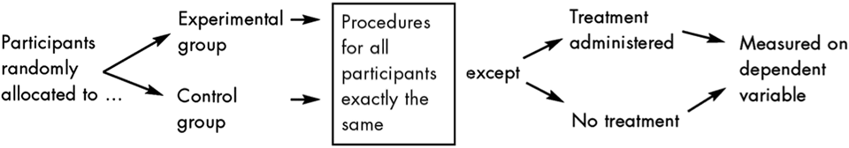

# Research Methodologies

## Notes

- **Deductive thinking**: Start from general principles to derive theory.
- **Inductive thinking**: Start from data to derive theory.
- Both must be used to experiment on hypothesis.

- An experiment is when *one* variable changes while *all others* remain constant.

- **Cross sectional study**: study at a given point in time.
- **Longitudinal study**: studen with the same sample over time.


## Research

### Terms and Concepts

- [Confounding variables](#confounding-vars)
- [Control group](#control-group)
- [Inference](#inference)
- [Instrument Reliability](#instrument-reliability)
- [Instrument Validity](#instrument-validity)
- [Validity](#validity)


#### <a name="confounding-vars"></a> Confounding variables

- Definition: Differences between conditions that could account for observed differences in the dependent variable.


#### <a name="control-group"></a> Control group



- Definition: A control group in a scientific experiment is a group separated from the rest of the experiment, where the independent variable being tested cannot influence the results. This isolates the independent variable's effects on the experiment and can help rule out alternative explanations of the experimental results.
- Participants that do not receive “treatment” thought to produce
a change in the dependent variable  
- Provide baseline comparison measure  
- One of the simplest forms of control to eliminate alternative
explanations 


#### <a name="inference"></a> Inference

- Take a sample, estimate something (ex. the mean), then assume it applies to the whole population.


#### <a name="instrument-reliability"></a> Instrument Reliability

> “Does the instrument produce the same readings in the same circumstances?”


#### <a name="instrument-validity"></a> Instrument Validity

> “Does the instrument measure what it is intended to measure?”


#### <a name="reviews"></a> Reviews

| Systematic Review | Narrative Review |
|---|---|
| Scientific approach to a review article | Depend on authors’ inclination (bias) |
| Criteria determined at outset | Author gets to pick any criteria |
| Comprehensive search for relevant articles | Search any databases |
| Explicit methods of appraisal and synthesis | Methods not usually specified |
| Meta-analysis may be used to combine data | Vote count or narrative summary |
|   | Can’t replicate review |


#### <a name="validity"></a> Validity

- **Internal validity**: The independent variable did affect the dependent variable
- **Construct validity**: Validity of the psychological construct, e.g. validity of IQ test with respect to “intelligence” (i.e. use SoA methods)
- **External validity**: Can the effect demonstrated in an experiment be generalized beyond the exact experimental context.


## Statistics

A **statistic** is anything that can be computed from collected data.

Examples:  
- **Point statistic**: A single value computed from data, e.g. the sample average $x̄_n$, or the sample standard deviation $s_n$  
- **Interval, or range statistics**: an interval $[a,b]$ computed from the data. A pair of point statistics. Often written as $x̄ \pm s$.


### Terms and Concepts

- [Alpha](#alpha)
- [ANOVA](#anova)
- [Central limit theorem](#central-limit-theorem)
- [Confidence interval](#confidence-interval)
- [Correlation](#correlation)
- [Degrees of freedom](#degrees-of-freedom)
- [Interquartile range](#interquartile-range)
- [Mean](#mean)
- [Median](#median)
- [Mode](#mode)
- [Margin of error](#margin-of-error)
- [Non-parametric test](#non-parametric-test)
- [Null hypothesis](#null-hypothesis)
- [Parametric test](#parametric-test)
- [Power](#power)
- [Q-Q Plot](#q-q-plot)
- [R](#r)
- [Range](#range)
- [Sample distribution](#sample-distribution)
- [Significance test](#significance-test)
- [Standard deviation](#standard-deviation)
- [Standard error of the mean](#standard-error-of-mean)
- [t-critical value](#t-critical-value)
- [t-distribution](#t-distribution)
- [t-statistic](#t-statistic)
- [t-table](#t-table)
- [t-test](#t-test)
- [t-value](#t-value)
- [Type I error](#type-i-error)
- [Type II error](#type-ii-error)
- [Variance](#variance)
- [z-score transformation](#z-score-transformation)


#### <a name="alpha"></a> Alpha

Definition:

- The likelihood that the true population parameter lies outside the confidence interval.

Notes:

- With respect to hypothesis tests, alpha refers to significance level, the probability of making a Type I error.
- Value of the p-value under which science accepts the alternative hypothesis ($H_A$)

Symbol used:

- $α$


#### <a name="anova"></a> ANOVA

Definition:

- "Analysis of variance"
- A parametric test to verify an overal experimental effect.


#### <a name="central-limit-theorem"></a> Central limit theorem

Definition:

- The bigger is the $n$ (the size of the sample), the smaller is the standard deviation.

Notes:

- When a sample size is above 30:
  - Assume normal distribution;
  - Use parametric test.


#### <a name="confidence-interval"></a> Confidence interval

Notes:

- One margin of error above sample proportion, and one margin of error below proportion level to determine confidence interval.
- Will include true proportion 95% of the time.


#### <a name="correlation"></a> Correlation

Definition:

- When two things are related to each other, meaning when their value change at the same time.  

Notes:

- Types of relations:
  - Positive relation
  - Negative relation
  - No relation
- ⚠️ The fact that 2 variables correlate at a point in time does not mean they covariate over time.
- ⚠️ Correlation does not mean causation.
- Spurious correlation: data that looks related, but is more likely a coincidence.  

  For example:
	- [Spurious correlations, by Tyler Vigen](http://www.tylervigen.com/spurious-correlations)
	- [Spurious relationship on Wikipedia](https://en.wikipedia.org/wiki/Spurious_relationship)

- Pearson's correlation coefficient
	- Measures linear dependance between two variables
	- Standardized covariance
	- Assumes normal distribution
	- Formula:
		
		$$cov(x,y) = \frac{\sum^n_{i = 0}(x_1 - x̄)(y_1 - \hat{y})}{n - 1}$$


#### <a name="degrees-of-freedom"></a> Degrees of freedom

Formula:

Given that $n$ is the size of the sample:

$$dof = n - 1$$


#### <a name="interquartile-range"></a> Interquartile range

Definition:

- Difference between the median of the first half, and the median of the second half. It is a measure of dispersion.

Notes:

- ⚠️ Can *only* be used when distribution is *not* normal.

Symbol used:

- $IQR$


#### <a name="mean"></a> Mean

Definition:

- The average, or arithmetic mean. The sum of all the numbers, divided by the amount of numbers.

Notes:

- Measure of central tendency
- Sometimes, the mean is not descriptive, e.g. a high value can affect the mean.


Symbols used:

- Population mean: $µ$
- Sample mean: $x̄$


#### <a name="median"></a> Median

Definition:

- A value that divides the sample in two equal parts. The number in the middle of the list once ordered. 

Notes:

- Measure of central tendency
- In the case of a list with a length of an even number, there would be two middle numbers. The mean of the two middle numbers is then the median.
  

#### <a name="mode"></a> Mode

Definition:

- Number that shows up the most in a dataset.

Notes:

- Measure of central tendency


#### <a name="margin-of-error"></a> Margin of error

Notes

- Not fixed
- Calculated with the standard error
- Lowering margin of error requires a larger sample size


#### <a name="non-parametric-test"></a> Non-parametric test

Properties:

- More conservative
- Less statistical power
- More likely than parametric test to produce Type II error

Examples: 

- Mann-Whitney test
- Wilcoxon signed-rank test
- Kruskal-Wallis test

Assumptions:

- Random independent samples
- Mann-Whitney test: two samples that have the same shape
- Wilcoxon signed-rank test: symmetric distribution
- Kruskal-Wallis and Friedman's ANOVA: same shape and equal variance


#### <a name="null-hypothesis"></a> Null hypothesis

Definition:

- A null hypothesis ($H_0$) predicts that there is no difference between the groups studied (ex. experimental vs. control group), or that there is no relation between the variables studied.

Notes:

- There is no statistically significant difference between the samples. Any difference found is simply due to chance.
- A null hypothesis ($H_0$) is the alternative to our tentative hypothesis ($H_A$)
- ⚠️ A null hypothesis ($H_0$) can never be accepted. Either the alternative hypothesis ($H_0$) is true, or we know nothing.


#### <a name="p-value"></a> p-value

Definition:

- Probability that our data would be *at least this inconsistent* with the alternative hypothesis ($H_A$), assuming the hypothesis is true.

Notes:

- A p-value cannot be $1$ or $0$
- A p-value always represents something as long as the null hypothesis ($H_0$) is true


#### <a name="power"></a> Power

Definition:

- Power represents the probability of detecting an significant result whenever it truly occurs

Notes:

- Statistical power is related to sample size and other characteristics of experiment
- Goal is to determine power achieved by certain sample size or determine sample size necessary to achieve desired power
- When in need to increase the power of a test, increase the sample size.
- Power can be quantified by doing a power analysis.
- With more power, the accuracy of the mean increases.
- However, samples that are too big could reveal insignificant/irrelevant hypothesis.


#### <a name="parametric-test"></a> Parametric test

Notes:

- A parametric test is the first option to choose when testing.

Properties:

- Statistically more powerful; more likely to detect a difference that truly exists
- Less likely than non-parametric tests to make a Type II error

Examples: 

- Independent-samples t-test
- Paired-samples t-test
- One-way ANOVA

Assumptions:

- Random independent samples
- Interval or ratio level of measurement
- Normal distribution
- No outliers
- Homogeneity of variance
- Sample size larger than minimum for non parametric test

Corresponding non-parametric tests:

| Parametric tests | Non-parametric tests |
|------------------|----------------------|
| Independant samples t-test | Mann-Whitney test |
| Paired-samples t-test | Wilcoxon signed-rank test |
| One-way ANOVA | Kruskal-wallis test |
| One-way repeated measures ANOVA | 	Friedman's ANOVA |


#### <a name="q-q-plot"></a> Q-Q Plot

Notes:

- A mapping of a normal distribution on another cartesian view, where the x axis are the values obtained, and the y values are the expected values.
- A normal distribution would show a straight line heading up o nthe right.


#### <a name="r"></a> R

Notes:

- Indicates whether a relation is positive or negative.
- Represents the strength of a relationship.
- Also called the *correlation coefficient*.


#### <a name="range"></a> Range

Definition:

- Difference between highest value, and lowest value. Basic measure of dispersion, does not provide information about distribution.


#### <a name="sample-distribution"></a> Sampling distribution

Definition:

- A distribution of all possible means from $n$ people.


#### <a name="significance-test"></a> Significance test

Notes:

- Statistical significance is unlikely to happen by chance.
- $p < .05$ means the result was significant.
- $p < .01$ means the result was highly significant.
- $p <= .1$ means we cannot be confident in the result, however it may indicate a trend towards significance. Results cannot be published and declared as an effect. However, might be worth pursuing the research.
- $p < .01$ means the result is so significant that it may be about to challenge a well established theory or research findings. The convention is to achieve $p < .01$.


#### <a name="standard-deviation"></a> Standard deviation

Notes:

- Standard deviation is the root of the variance.
- $±1.96$ (or ~$2$) deviations contains 95% of sample;
	- This assumes a big $n$ (30+);
	- With a smaller $n$, use the t-critical value obtained from a t-table.
- ⚠️ Can *only* be used with a normal distribution.
- Symbol used: $σ$ (sigma)

Formula:

$$\sigma = \sqrt{\frac{1}{n}\sum^n_{i=1}(x_i-\mu)^2}$$

Formula (standard deviation of the sample):

$$s = \sqrt{\frac{1}{n-1}\sum^n_{i=1}(x_i-x̄)^2}$$


#### <a name="standard-error-of-mean"></a> Standard error of the mean

Definition:

- The theoretical standard error of the mean is a function of the standard deviation ($σ$) and the sample size ($n$). Depends on the size of the sample.

Formula: 

$$sem = \frac{σ}{\sqrt{n}}$$


#### <a name="t-critical-value"></a> t-critical value

Notes:

- Obtained from the t-table by looking where the row $dof = n - 1$ intersects with the $\alpha$ chosen for the experiment.
- Value under which most values of the sample must fall.
- If calculated t-value falls within this range, the null hypothesis is likely true.


#### <a name="t-distribution"></a> t-distribution

Notes:

- The shape of the t-distribution depends on the number of samples, and as that number grows, it resembles more closely a Normal distribution.
- The difference between the t-distribution and a the Normal one is that the t-distribution assigns a higher probability to events far away from the mean that the Normal distribution does.
- t-distribution is used to compute confidence intervals


#### <a name="t-statistic"></a> t-statistic

Definition:

- The ratio of the departure of the estimated value of a parameter from its hypothesized value to its standard error.

Notes:

- Also known as *t-score*.
- Use this value to look up the t-table

Formula:

Given that

- $x̄$ is the sample mean
- $\mu$ is the population mean
- $s$ is the standard deviation
- $n$ is the sample size

$$t = \frac{x̄ - \mu}{\frac{s}{\sqrt{n}}}$$


#### <a name="t-table"></a> t-table

Notes

- Allows to see the probability (% of confidence) with degrees of freedom
- Has as many curves as there are possible $n$


#### <a name="t-test"></a> t-test

Notes: 

- Test to calculate the difference between two samples

Assumptions:

- Normal distribution in both samples
- Homogeneity of variance in both samples (f-test, e.g. Levene's test)
- Datapoints:
  - Roughly same amount in either samples
  - 20-30 range (higher -> use z-test)

Examples:

- **Paired t-test**: testing same sample at different moments
- **Two-sample t-test**: testing different samples

Steps:

1. Formulate hypotheses $H_0$ and $H_A$.
2. Determine type of t-test
	- One-sample: Compare $\mu$ (estimated or given) with a sample mean
	- Independent: Two groups ($x̄_1$ vs. $x̄_2$)
	- Dependent: Repeated measures
3. Obtain t-stat
4. Look at t-table with obtained t-stat and $dof = n - 1$ to find t-critical value  
	↳ If the t-critical value is under the chosen $\alpha$, this means the null hypothesis ($H_0$)


#### <a name="t-stat"></a> t-statistic

Formula for one sample t-test:

Given that:  
- $x̄$: sample mean  
- $μ$: population mean  
- $s$: sample standard deviation  
- $n$: sample size  

$$t = \frac{x̄ - μ}{\frac{s}{\sqrt{n}}}$$


#### <a name="t-value"></a> t-value

Notes:

- If higher than 1: more signal than noise

Formula:

$$t = \frac{x̄_1 - x̄_2}{S_p\sqrt{\frac{1}{n_1} + \frac{1}{n_2}}}$$


#### <a name="type-i-error"></a> Type I error

Definition:

- Rejection of the null hypothesis when in fact the null hypothesis was true.


#### <a name="type-ii-error"></a> Type II error

Definition:

- Failure to reject the null hypothesis when in fact the null hypothesis was false.


#### <a name="variance"></a> Variance

Definition:

- Measures of how far a data set is spread out.

Notes:

- The average of the squared differences between each data point and the mean.
- Symbols used: σ<sup>2</sup> or s<sup>2</sup> (sigma squared)

Formulas:

- Variance of the population:

$$\sigma^2 = \frac{\sum_{i=0}^{i=N}(x_i - µ)^2}{N}$$

- Variance of the sample:

$$s^2 = \frac{\sum_{i=0}^{i=n}(x_i - x̄)^2}{n - 1}$$

ex.:

````
datasetA: -10, 0, 10, 20, 30
datasetB: 8, 9, 10, 11, 12

mean datasetA: 10
mean datasetB: 10
````

They have the same mean, however quite a different range:

````
range datasetA: 40
range datasetB: 4
````

Calculating the variance in `datasetA`:

````
(-10 - 10)^2 + (0 - 10)^2 + (10 - 10)^2 + (20 - 10)^2 + (30 - 10)^2   1000
——————————————————————————————————————————————————————————————————— = ———— = 200
                                 5                                      5
````

Thus, the variance of `datasetA` is $σ^2$ = 200.

And so, going through the same process for `datasetB`, we discover that its variance is $σ^2 = 2$.


#### <a name="z-score-transformation"></a> z-score transformation

Definition:

- A mapping of the sample values from ~$-3$ to ~$3$, so that the mean is mapped to $0$.

Notes:

- Is an array of the same length as $n$, but with mapped values instead of actual values.
- Each unit is then one standard deviation from the mean.

Formula:

$$z_{i} = \frac{x_i - x̄}{s}$$


### Resources

- [A (very) friendly introduction to Confidence Intervals](https://towardsdatascience.com/a-very-friendly-introduction-to-confidence-intervals-9add126e714)
- [Choosing a non-parametric test](http://changingminds.org/explanations/research/analysis/choose_nonparametric.htm)
- [de Winter - Using the Student’s t-test with extremely small sample sizes](https://pareonline.net/getvn.asp?v=18&n=10)
- [Free Statistics Calculators - One-Sample T-Test](https://www.danielsoper.com/statcalc/calculator.aspx?id=98)
- [How To... Perform a Wilcoxon Signed Rank Test (By Hand)](https://www.youtube.com/watch?v=TqCg2tb4wJ0)
- [How To... Perform the Mann-Whitney U Test (By Hand)](https://www.youtube.com/watch?v=BT1FKd1Qzjw)
- [How To... Test for Equal and Unequal Variance (F Test) by Hand](https://www.youtube.com/watch?v=-ukqBN5sQSI)
- [Khan Academy - Hypothesis testing and p-values](https://www.youtube.com/watch?v=-FtlH4svqx4)
- [Khan Academy - Mean, median, & mode example](https://www.khanacademy.org/math/ap-statistics/summarizing-quantitative-data-ap/measuring-center-quantitative/v/mean-median-and-mode)
- [Khan Academy - Measures of spread: range, variance & standard deviation](https://www.khanacademy.org/math/probability/data-distributions-a1/summarizing-spread-distributions/v/range-variance-and-standard-deviation-as-measures-of-dispersion)
- [Khan Academy - One-tailed and two-tailed tests | Inferential statistics | Probability and Statistics](https://www.youtube.com/watch?v=mvye6X_0upA)
- [Khan Academy - P-values and significance tests](https://www.youtube.com/watch?v=KS6KEWaoOOE)
- [Khan Academy](https://www.khanacademy.org/)
- [Parametric and Nonparametric Statistical Tests](https://www.youtube.com/watch?v=pWEWHKnwg_0)
- [Stackexchange Stats - "[There] is no fundamental objection to using a regular t-test with extremely small sample sizes"](https://stats.stackexchange.com/questions/294682/t-test-using-a-sample-less-than-30)
- [Statistics Solutions - One Sample T Test: How to Run It, Step by Step](https://www.statisticshowto.datasciencecentral.com/one-sample-t-test/)
- [Statistics Solutions - Paired Sample T-Test](https://www.statisticssolutions.com/manova-analysis-paired-sample-t-test/)
- [Student's t-test](https://www.youtube.com/watch?v=pTmLQvMM-1M)
- [Wikipedia - Mean](https://en.wikipedia.org/wiki/Mean)
- [Wikipedia - Median](https://en.wikipedia.org/wiki/Median)


## Python, etc

### Resources

#### Matplotlib (`plt`)

- [`matplotlib.pyplot` API](https://matplotlib.org/api/_as_gen/matplotlib.pyplot.html#module-matplotlib.pyplot)
- [Matplotlib Website](https://matplotlib.org/)
- [Matplotlib Github Repo](https://github.com/matplotlib/matplotlib)
- [Matplotlib Tutorial Series - Graphing in Python](https://www.youtube.com/watch?v=q7Bo_J8x_dw&list=PLQVvvaa0QuDfefDfXb9Yf0la1fPDKluPF)

#### Numpy

- [Numpy reference](https://docs.scipy.org/doc/numpy/reference/)

#### Pandas

- [Pandas](https://pandas.pydata.org/)
- [Pandas API](https://pandas.pydata.org/pandas-docs/stable/api.html)

#### SciPy

- [`scipy.stats` API](https://docs.scipy.org/doc/scipy/reference/stats.html)
